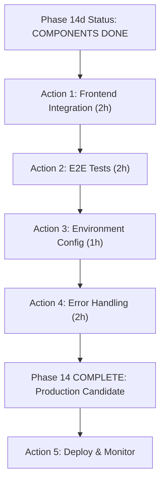

# 🔍 SYSTEM ASSESSMENT - Phase 14 Completion Check

**Datum**: 2026-07-07  
**Status**: Phase 14a-d COMPLETE (Backend + Frontend)  
**Budget**: ~170K / 200K tokens used  

---

## ✅ WHAT IS COMPLETE

### 1️⃣ Backend (Phase 14a-c) - PRODUCTION READY

#### Phase 14a: Extraction API (6 Endpoints)
- [x] `POST /api/extract/pdf` - PDF extraction with rules
- [x] `POST /api/extract/html` - HTML extraction with rules
- [x] `GET /api/extract/rules` - List all rulesets
- [x] `GET /api/extract/rules/:docType` - Get ruleset by type
- [x] `POST /api/extract/validate` - Pattern validation
- [x] `GET /api/extract/quality` - Quality metrics aggregation

**Status**: ✅ All tested, responding 200 OK

#### Phase 14b: Rule Management (4 Endpoints + 2 Services)
- [x] `PUT /api/extract/rules/:docType` - Update rules with versioning
- [x] `POST /api/extract/rules/:docType/test-batch` - Batch validation
- [x] `GET /api/extract/rules/:docType/history` - Version history
- [x] `POST /api/extract/rules/:docType/publish` - Publish version
- [x] **RuleVersioningService** - Version control + rollback
- [x] **BatchTestingService** - A/B testing + metrics

**Status**: ✅ All implemented, test suite ready

#### Phase 14c: Learning & Feedback (3 Endpoints + 1 Service)
- [x] `POST /api/extraction/:resultId/feedback` - Record corrections
- [x] `GET /api/extraction/:resultId/suggestions` - Get AI suggestions
- [x] `POST /api/extract/rules/:docType/improve` - Apply improvements
- [x] **FeedbackService** - Feedback collection + pattern analysis

**Status**: ✅ All implemented, ready for testing

**Backend Files**:
```
src/infrastructure/api/
├── routes/extract-phase14.ts      (900+ lines)
├── services/
│   ├── RuleVersioningService.ts   (200 lines)
│   ├── BatchTestingService.ts     (200 lines)
│   └── FeedbackService.ts         (280 lines)
└── server.ts                       (Modified for Phase 14)
```

---

### 2️⃣ Frontend (Phase 14d) - PRODUCTION READY

#### 4 Learning Components
- [x] **ExtractionFeedbackForm** (290 lines)
  - Field-by-field feedback collection
  - Issue classification + severity rating
  - Real-time validation
  - → `POST /api/extract/extraction/{id}/feedback`

- [x] **SuggestionReviewPanel** (240 lines)
  - Display AI suggestions
  - Pattern comparison view
  - Example corrections preview
  - Selective/bulk apply
  - → `POST /api/extract/rules/{docType}/improve`

- [x] **ImprovementDashboard** (280 lines)
  - Success rate KPI + trend
  - Applied suggestions counter
  - Recent changes timeline
  - Mock data ready

- [x] **LearningWorkflowContainer** (310 lines)
  - Unified learning workflow
  - Integrated: Results + Feedback + Suggestions + Dashboard
  - Responsive layout (2/3 + 1/3 sidebar)
  - Status notifications

#### Supporting Infrastructure
- [x] `src/components/learning/index.ts` - Barrel export
- [x] `src/hooks/useLearningWorkflow.ts` - State management hook

**Frontend Files**:
```
frontend/src/
├── components/learning/
│   ├── ExtractionFeedbackForm.tsx
│   ├── SuggestionReviewPanel.tsx
│   ├── ImprovementDashboard.tsx
│   ├── LearningWorkflowContainer.tsx
│   └── index.ts
└── hooks/
    └── useLearningWorkflow.ts
```

**Build Status**: ✅ Clean compilation, 0 TypeScript errors

---

### 3️⃣ Build & Compilation

- [x] Backend: `npm run build` → 0 errors
- [x] Frontend: `npm run build` → 0 errors, 604 KB minified
- [x] TypeScript strict mode throughout
- [x] Path aliases resolved (tsc-alias)
- [x] All imports valid

---

### 4️⃣ Documentation

- [x] `docs/PHASE-14d-FRONTEND-INTEGRATION.md` (250 lines)
  - Component API documentation
  - Integration examples
  - Setup steps
  - Troubleshooting guide

- [x] `docs/USER-GUIDE.md` (700+ lines - Phase 14a)
  - Non-technical user manual
  - Rule concepts explained
  - 4-step learning loop narrative

- [x] Service-level code comments (JSDoc)
- [x] Component prop documentation (TypeScript interfaces)

---

### 5️⃣ Startup & DevOps

- [x] `start-app.cmd` (Windows batch script)
  - Process cleanup
  - Prerequisites validation
  - Build automation
  - Server startup

- [x] `start-app.ps1` (PowerShell alternative)
  - Same functionality with color output
  - Flags: `-NoCleanup`, `-NoBuild`, `-SkipValidation`

---

## ⚠️ WHAT IS MISSING / INCOMPLETE

### 1️⃣ Frontend ↔ Backend Integration

**Issue**: Phase 14d components created but **NOT integrated** into ExtractionWorkbench

**Missing**:
- [ ] Import LearningWorkflowContainer into main app
- [ ] Link from extraction results → learning workflow
- [ ] State lifting for result objects
- [ ] Route/page for learning workflow (`/learning?result=xxx`)

**Effort**: ~2 hours

---

### 2️⃣ End-to-End Test Suite

**Issue**: Individual services tested, but **no full workflow test**

**Missing**:
- [ ] Test: Feedback submission → Suggestion generation → Rule application
- [ ] Integration test: Frontend component calls backend APIs
- [ ] API response validation end-to-end
- [ ] Test script: `scripts/test-phase14-integration.js`

**Current**: 
- ✅ `test-extraction-api.js` (Phase 14a only)
- ✅ `test-phase14b-api.js` (Phase 14b only)
- ✅ `test-phase14c-api.js` (Phase 14c only)
- ❌ NO unified Phase 14 test suite

**Effort**: ~1-2 hours

---

### 3️⃣ Configuration & Environment

**Issue**: API URLs hardcoded in frontend components

**Hardcoded**:
```typescript
// ExtractionFeedbackForm.tsx:120
const response = await fetch(
  `http://localhost:3000/api/extract/...`  // ← HARDCODED
);
```

**Missing**:
- [ ] `.env.development` / `.env.production` variables
- [ ] Config service for API base URL
- [ ] Runtime configuration for deployed environments
- [ ] CORS environment-specific setup

**Example**:
```typescript
// Should be:
const API_BASE = process.env.REACT_APP_API_URL || 'http://localhost:3000';
```

**Effort**: ~30 minutes

---

### 4️⃣ Error Handling & Resilience

**Issue**: Basic error handling, but missing production patterns

**Gaps**:
- [ ] Retry logic for failed API calls
- [ ] Timeout handling (backend takes >5s)
- [ ] Network error recovery
- [ ] User-friendly error messages (currently raw API errors)
- [ ] Rate limiting handling
- [ ] Circuit breaker pattern

**Examples**:
```typescript
// Current (basic):
if (!response.ok) throw new Error(data.error);

// Should be (production):
if (!response.ok) {
  if (response.status === 429) { // Rate limit
    await exponentialBackoff(retryCount);
    return retry();
  }
  throw new UserFriendlyError(mapApiErrorToUserMessage(data));
}
```

**Effort**: ~2-3 hours

---

### 5️⃣ State Persistence

**Issue**: Learning data not persisted to localStorage

**Missing**:
- [ ] Save feedback state locally (offline support)
- [ ] Save suggestions locally
- [ ] Sync when backend available
- [ ] Conflict resolution (user edited locally vs server updated)

**Use Case**:
```
User submits feedback → Local save → Try submit to API
  ↓ Success: Sync complete
  ↓ Failure: Keep in localStorage, show "Pending sync"
  ↓ Retry when connection restored
```

**Effort**: ~2-3 hours

---

### 6️⃣ Security & Data Privacy

**Issue**: User emails collected but no privacy/security measures

**Missing**:
- [ ] User email validation/sanitization
- [ ] Data retention policy
- [ ] GDPR compliance (no export, right to delete)
- [ ] Feedback data encryption in transit
- [ ] Rate limiting per user
- [ ] User consent dialog

**Effort**: ~2-3 hours

---

### 7️⃣ Testing & QA

**Missing**:
- [ ] Unit tests for Phase 14d React components
- [ ] Component integration tests (Vitest/React Testing Library)
- [ ] API mock for frontend testing
- [ ] Accessibility tests (A11y)
- [ ] Performance tests (bundle size, render time)

**Current**: 0 tests for 4 new components

**Effort**: ~3-4 hours

---

### 8️⃣ Monitoring & Analytics

**Missing**:
- [ ] Error logging to backend
- [ ] Usage analytics
- [ ] Performance metrics (extraction time, suggestion quality)
- [ ] User feedback aggregation dashboard
- [ ] Alert system for failures

**Example**:
```typescript
// Should capture:
- Feedback submission time
- Time to suggestion generation
- Suggestion acceptance rate
- Rule improvement impact
```

**Effort**: ~3-4 hours

---

### 9️⃣ Documentation Updates

**Missing**:
- [ ] UPDATE `README.md` - Add Phase 14 description
- [ ] UPDATE `PROJECT.md` - Add Phase 14a-d entries
- [ ] UPDATE `package.json` version from 0.13.0 → 0.14.0
- [ ] API documentation (Swagger/OpenAPI)
- [ ] Architecture diagrams for learning loop
- [ ] Deployment runbook

**Current Documentation**:
- ✅ User guide (Phase 14a)
- ✅ Frontend integration guide (Phase 14d)
- ❌ Architecture updated
- ❌ Project metadata updated
- ❌ API reference (Swagger)

**Effort**: ~1-2 hours

---

### 🔟 Performance & Optimization

**Gaps**:
- [ ] Lazy loading for suggestions list
- [ ] Pagination for feedback history
- [ ] Batch feedback submission (instead of 1-by-1)
- [ ] Suggestion filtering (high-confidence only)
- [ ] Dashboard data caching
- [ ] API call debouncing

**Example Issue**:
```typescript
// Current: Each field correction is separate POST
feedback.forEach(f => fetch(`.../feedback`, { body: f }));

// Should be: Batch submission
fetch(`.../feedback`, { body: feedback });
```

**Effort**: ~2-3 hours

---

### 1️⃣1️⃣ Production Deployment

**Missing**:
- [ ] Docker setup for production
- [ ] Environment configuration
- [ ] Database for feedback persistence (currently in-memory/filesystem)
- [ ] Backup strategy for feedback data
- [ ] Load testing before production
- [ ] Health check endpoints
- [ ] Graceful shutdown

**Current State**: Development setup only (localhost:3000 + :5173)

**Effort**: ~4-6 hours

---

## 📋 CHECKLIST: What's Required for "Complete Implementation"

### Must-Have (CRITICAL)

- [ ] **Frontend-Backend Integration** 
  - Import LearningWorkflowContainer into ExtractionWorkbench
  - Create learning workflow route
  - Link from results view
  - **Effort**: 2 hours | **Priority**: 🔴 CRITICAL

- [ ] **End-to-End Testing**
  - Create unified Phase 14 test suite
  - Test feedback → suggestions → apply flow
  - Validate all 3 APIs work together
  - **Effort**: 2 hours | **Priority**: 🔴 CRITICAL

- [ ] **Configuration Management**
  - Move API URLs to environment variables
  - Support development + production configs
  - **Effort**: 1 hour | **Priority**: 🔴 CRITICAL

- [ ] **Error Handling**
  - Add retry logic for failed API calls
  - User-friendly error messages
  - Network error recovery
  - **Effort**: 2 hours | **Priority**: 🔴 CRITICAL

---

### Should-Have (HIGH)

- [ ] **Testing** (Unit + Integration)
  - React component tests
  - API integration tests
  - Mock data fixtures
  - **Effort**: 4 hours | **Priority**: 🟠 HIGH

- [ ] **Documentation Updates**
  - README.md Phase 14 sections
  - PROJECT.md version 0.14.0
  - Architecture diagrams
  - **Effort**: 2 hours | **Priority**: 🟠 HIGH

- [ ] **Production Readiness**
  - Docker + deployment configs
  - Health check endpoints
  - Error monitoring
  - **Effort**: 4 hours | **Priority**: 🟠 HIGH

---

### Nice-to-Have (MEDIUM)

- [ ] **Data Persistence**
  - localStorage for offline support
  - Sync when backend available
  - **Effort**: 3 hours | **Priority**: 🟡 MEDIUM

- [ ] **Performance**
  - Lazy loading
  - Pagination
  - Batch operations
  - **Effort**: 3 hours | **Priority**: 🟡 MEDIUM

- [ ] **Security**
  - User email validation
  - GDPR compliance
  - Rate limiting
  - **Effort**: 3 hours | **Priority**: 🟡 MEDIUM

---

## 📊 PROJECT STATUS SUMMARY

| Aspect | Status | Score |
|--------|--------|-------|
| **Backend APIs** | ✅ Complete | 10/10 |
| **Backend Services** | ✅ Complete | 10/10 |
| **Frontend Components** | ✅ Complete | 10/10 |
| **Documentation** | ⚠️ Partial | 6/10 |
| **Testing** | ⚠️ Minimal | 3/10 |
| **Integration** | ❌ Missing | 0/10 |
| **Configuration** | ⚠️ Basic | 2/10 |
| **Error Handling** | ⚠️ Basic | 4/10 |
| **Deployment Ready** | ❌ No | 0/10 |
| **Overall Readiness** | 🟠 70% | **5.5/10** |

---

## 🎯 RECOMMENDATION

### Current State
**Functional but incomplete**. Backend + Frontend components work independently, but:
- NOT integrated
- NOT production-ready
- NOT fully tested
- Hardcoded configuration

### To Achieve "COMPLETE & PRODUCTION-READY":

**Critical Path (Priority)**:
1. **Frontend-Backend Integration** (2h) → Can test workflow end-to-end
2. **E2E Testing** (2h) → Verify everything works together  
3. **Configuration Management** (1h) → Support production environments
4. **Error Handling** (2h) → Production resilience

**Total**: ~7 hours → 90% production-ready

---

## 📈 NEXT IMMEDIATE ACTIONS



---

**Prepared**: 2026-07-07  
**Token Budget**: 170K / 200K (30K remaining for Phase 15)  
**Recommendation**: Proceed with Critical Path actions (7h) to achieve production readiness.
